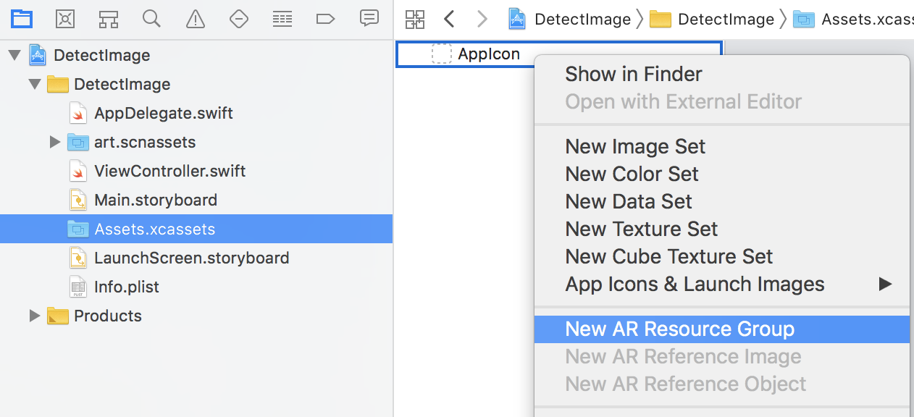
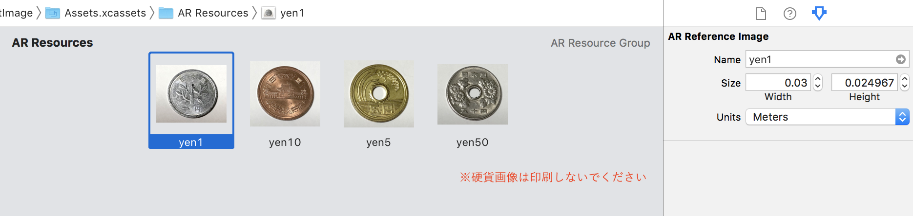
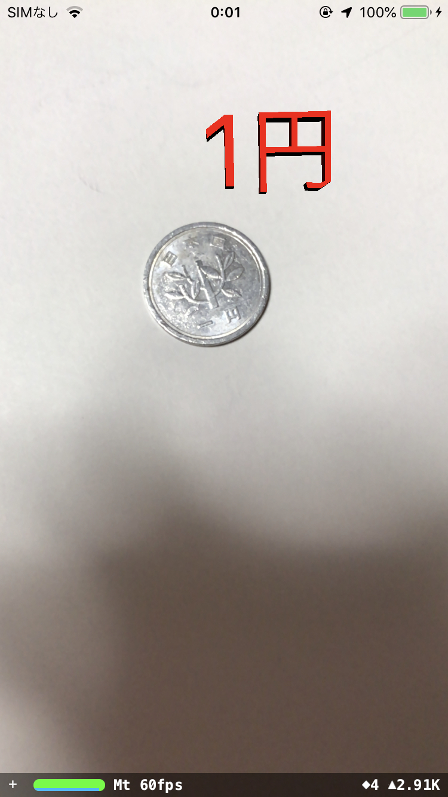

## DetectImage
### 概要
画像を認識し、3D文字を配置する。
### 作成手順  

1. Xcodeで新規プロジェクトを作成し、「Augmented Reality App」を選択。  
   

2. 任意のプロジェクト名(ここでは「DetectImage」)、Languageは「Swift」、Content Technologyは「SceneKit」を選択。  
SceneKit：簡単に3Dゲームを作ることができるフレームワーク  
  

3. 認識対象の画像を追加。  
Assets.xcassetsを選択し、右クリックから「New AR Resource Group」を実行。
   
画像をドラッグ＆ドロップで追加。 マーカーのサイズを指定。 
   

4. 飛行機を削除し、画像認識指定を追加。  
[変更内容](https://github.com/da351hon/DetectImage/commit/f40a5eeb27440544a370714697b72f97294db210)

5. 画像検出時に3D文字を配置する処理を追加。  
[変更内容](https://github.com/da351hon/DetectImage/commit/b761bd2c7702b6bc54e64742a0e3d074cc66528b)

6. 実行。  
   
