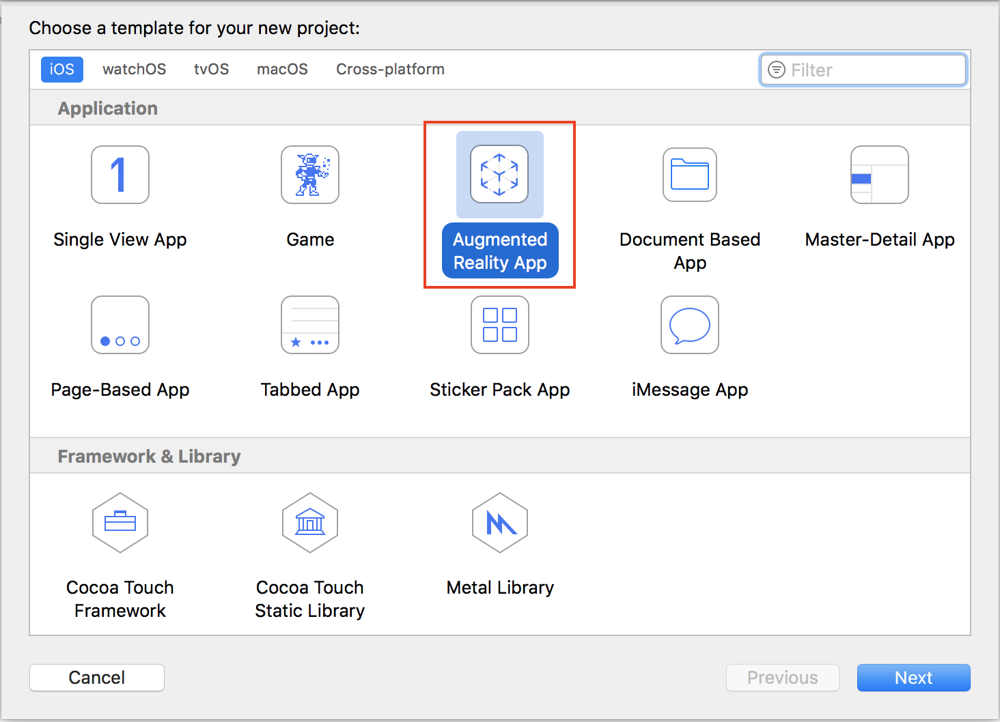
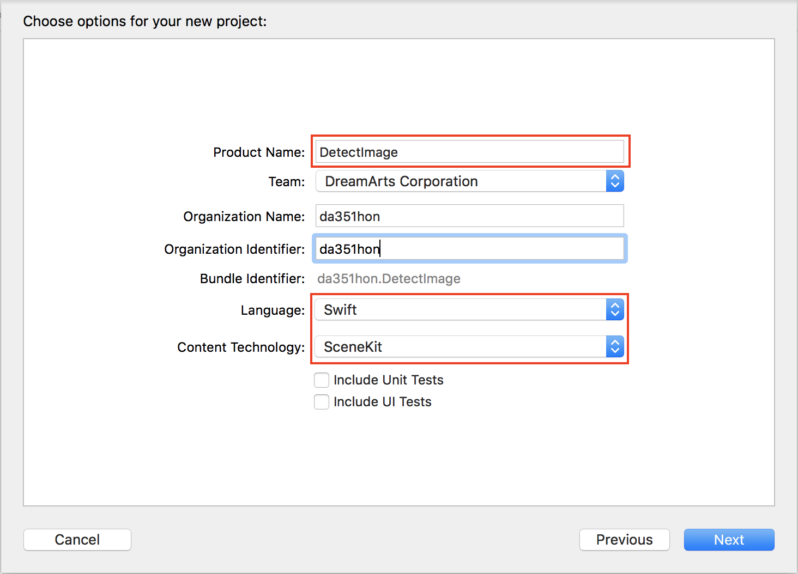

## DetectImage
### 概要
画像を認識し、3D文字を配置する。
### 作成手順  

1. Xcodeで新規プロジェクトを作成し、「Augmented Reality App」を選択。  
   

2. 任意のプロジェクト名(ここでは「DetectImage」)、Languageは「Swift」、Content Technologyは「SceneKit」を選択。  
SceneKit：簡単に3Dゲームを作ることができるフレームワーク  
  

3. 飛行機を削除し、画像認識指定を追加。  
[変更内容](https://github.com/da351hon/DetectHPlane/commit/2a964fc8b8b52a165174da7134336c1e415335cf)

4. 画像検出時に3D文字を配置する処理を追加。  
[変更内容](https://github.com/da351hon/DetectHPlane/commit/4280be1f1c8aea9408daf1aa038f70411c12b231)

5. 実行。
